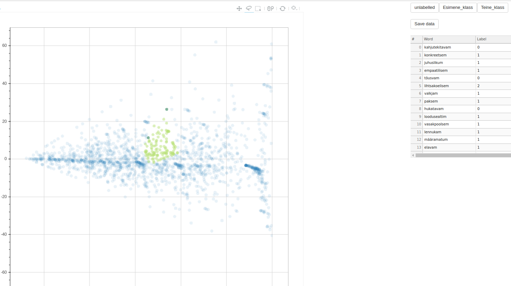
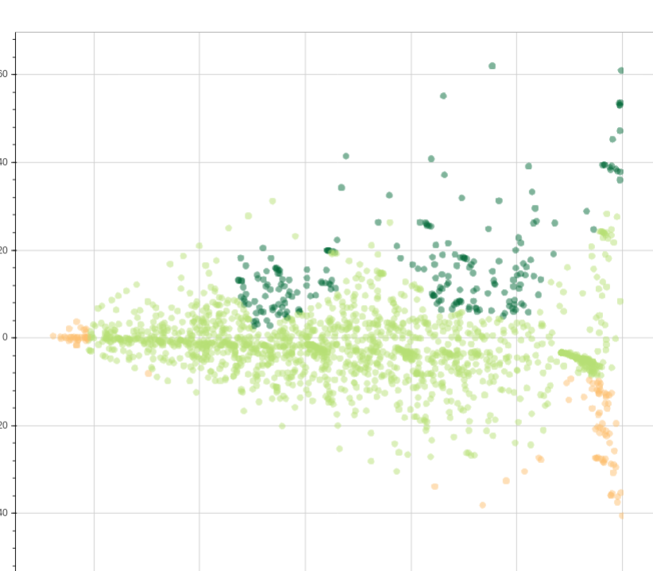

# cluster-labelling-plot

This is an example application for manual interactive clustering.
It leverages bokeh 0.11 and jupyter notebook to provide interaction. 
To run with demo data, select from the menu `cell -> run all`
To choose data to run on, see the cell "Reading the data".

## Motivation

This application allows for manual labelling of data-points with user-defined class values. 
This is useful for comparing and evaluating some automated classification or clustering algorithms. It can also be seen as an expert step after some automated clustering process.

